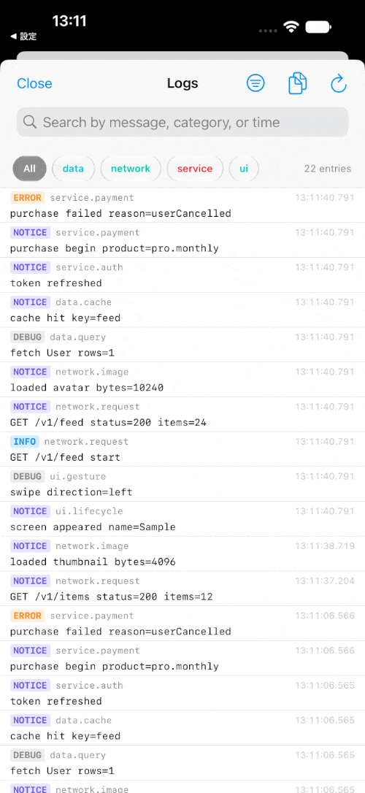

# OSLogViewer

[](https://github.com/shsw228/OSLogViewer/releases/latest)
[](https://shsw228.github.io/OSLogViewer/documentation/oslogviewer/)
[](#requirements)
[](#requirements)
[](LICENSE)

A self-contained SwiftUI viewer for the **current process's `OSLogStore`**.

The filter is generated from the log data itself: there is no fixed category
enum. Categories written as `<area>.<topic>` (e.g. `ui.capture`,
`service.camera`) are split into a two-tier **area → topic** filter that grows
dynamically as logs arrive.

## Demo



## Features

- **Dynamic hierarchical filter** — area / topic chips built from the categories
  actually present in the logs (no hard-coded list).
- **Level filter** — DEBUG / INFO / NOTICE / ERROR / FAULT, with an *All items*
  fallback (clearing every level shows all).
- **Search** across message, category, level and timestamp.
- **Copy / export** the filtered logs as plain text or a `.txt` file.
- **Headless export** — `OSLogExport.text/temporaryFile(subsystem:lookback:filter:)`
  collects logs (optionally narrowed by a `LogFilter`: levels, areas, categories,
  search) without showing the viewer — handy for a "report a problem" flow.
- **Localized** out of the box (English, Japanese) via a bundled String Catalog.
- No third-party dependencies — Apple frameworks only (see [Dependencies](#dependencies)).

## Requirements

- iOS 18+
- Swift 6.2

## Dependencies

No third-party packages. System frameworks only:

- `OSLog` — reading the current process's log store (`OSLogStore`).
- `SwiftUI` — the entire UI.
- `UIKit` — used in exactly one place: `UIPasteboard.general` for the **Copy**
  action. This is the only reason the package is iOS-only. To support other
  platforms, swap it for an AppKit `NSPasteboard` path (`#if canImport(UIKit)`)
  or inject the clipboard write from the host.

## Installation

Swift Package Manager:

```swift
.package(url: "https://github.com/shsw228/OSLogViewer.git", from: "0.1.0")
```

## Usage

Embed inside a navigation container and pass your `os.Logger` subsystem:

```swift
import OSLogViewer

NavigationStack {
    OSLogViewer(subsystem: "com.example.app")
}
```

An optional `title` overrides the default (localized "Logs"):

```swift
OSLogViewer(subsystem: "com.example.app", title: "Debug Log")
```

## Documentation

API reference (DocC, auto-published to GitHub Pages):
<https://shsw228.github.io/OSLogViewer/documentation/oslogviewer/>

## Sample

A small showcase: emit logs across categories/levels → view them → export them.

- **Run it:** open `Example.swiftpm` in Xcode and run on a simulator or device
  (a Swift Playgrounds App package; no `.xcodeproj` needed).
- **Or preview it:** open `Example.swiftpm/ContentView.swift` and run the
  `#Preview` in the Xcode canvas.

`Example.swiftpm/SampleLog.swift` documents how to structure `os.Logger`
categories (`<area>.<topic>`) and pick levels; events are seeded when the sample
appears and when the viewer opens so there is content immediately.

## Note on log levels

`OSLogStore` keeps `.debug` / `.info` entries only in an in-memory ring buffer
that the system may reclaim (e.g. around backgrounding). Use `.notice` or higher
for events that must survive such transitions.

## License

Apache-2.0. See [LICENSE](LICENSE).
